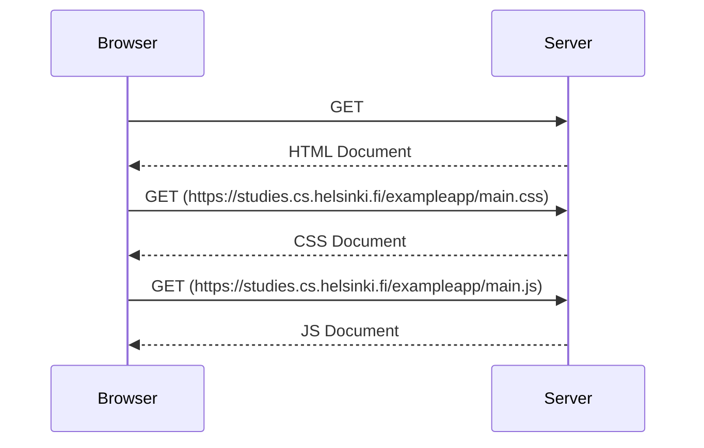

# FullStack open - Assignment 0.4

using GitHub Markdown-file with Mermaid-syntax to represent what is happening in this [web page](https://studies.cs.helsinki.fi/exampleapp/notes)

```mermaid 
sequenceDiagram
Browser->>Server: GET 

Server-->>Browser: HTML Document 

Browser->>Server: GET (https://studies.cs.helsinki.fi/exampleapp/main.css)

Server-->>Browser: CSS Document

Browser->>Server: GET (https://studies.cs.helsinki.fi/exampleapp/main.js)

Server-->>Browser: JS Document

```